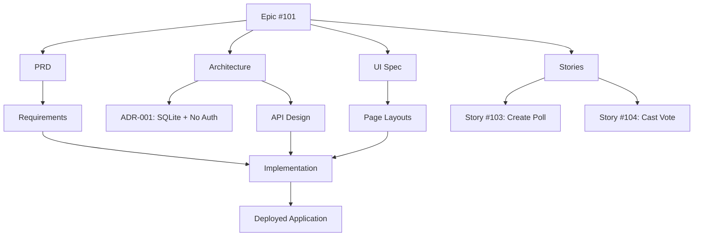

# Context Map — Friday Snack Vote

## Epic #101: Title Convention Snack Poll

This document provides a navigation map for all documentation related to Epic #101.

## Quick Links

| Document | Purpose | Path |
|----------|---------|------|
| **README** | Project overview and quick start | [README.md](README.md) |
| **CONTEXT** | High-level context and decisions | [CONTEXT.md](CONTEXT.md) |
| **PRD** | Product requirements | [docs/requirements/epic-101-prd.md](docs/requirements/epic-101-prd.md) |
| **Architecture** | System design and API specs | [docs/architecture/epic-101-architecture.md](docs/architecture/epic-101-architecture.md) |
| **UI Spec** | User interface design | [docs/ui/epic-101-ui-spec.md](docs/ui/epic-101-ui-spec.md) |
| **ADR-001** | SQLite + No Auth decision | [docs/adr/001-sqlite-no-auth.md](docs/adr/001-sqlite-no-auth.md) |
| **Stories** | Implementation stories | [docs/stories/epic-101-stories.md](docs/stories/epic-101-stories.md) |

## Documentation Flow

## Epic Structure

### Requirements Phase
- **Input**: Epic issue #101 with raw idea
- **Output**: [PRD](docs/requirements/epic-101-prd.md) with user stories and success criteria

### Architecture Phase
- **Input**: PRD requirements
- **Output**: 
  - [Architecture doc](docs/architecture/epic-101-architecture.md) with database schema and API design
  - [ADR-001](docs/adr/001-sqlite-no-auth.md) documenting key technology decisions

### Design Phase
- **Input**: Architecture and PRD
- **Output**: [UI Specification](docs/ui/epic-101-ui-spec.md) with page layouts and responsive design

### Implementation Phase
- **Input**: Architecture + UI Spec
- **Stories**: 
  - [Story #103](docs/stories/epic-101-stories.md#1-create-poll): Poll creation flow
  - [Story #104](docs/stories/epic-101-stories.md#2-cast-vote): Voting and results flow
- **Output**: Working application

## Key Decisions

### 1. Database: SQLite
- **Why**: Zero configuration, file-based, sufficient for small team
- **Trade-off**: Limited concurrent writes, single-server deployment
- **Details**: [ADR-001](docs/adr/001-sqlite-no-auth.md)

### 2. No Authentication
- **Why**: Simplicity, reduced friction, acceptable for low-stakes polls
- **Trade-off**: No duplicate vote prevention, no user attribution
- **Details**: [ADR-001](docs/adr/001-sqlite-no-auth.md)

### 3. Mobile-First UI
- **Why**: Primary use case is mobile voting
- **Trade-off**: None (responsive design works everywhere)
- **Details**: [UI Spec](docs/ui/epic-101-ui-spec.md)

## API Reference

### Endpoints

| Method | Path | Purpose | Details |
|--------|------|---------|---------|
| POST | /polls | Create poll | [Architecture](docs/architecture/epic-101-architecture.md#post-polls) |
| GET | /polls/:id | Get poll + results | [Architecture](docs/architecture/epic-101-architecture.md#get-pollsid) |
| POST | /polls/:id/votes | Submit vote | [Architecture](docs/architecture/epic-101-architecture.md#post-pollsidvotes) |

## Database Schema

### Tables

| Table | Purpose | Details |
|-------|---------|---------|
| polls | Store poll questions | [Architecture](docs/architecture/epic-101-architecture.md#polls) |
| poll_options | Store answer choices | [Architecture](docs/architecture/epic-101-architecture.md#poll_options) |
| votes | Record submitted votes | [Architecture](docs/architecture/epic-101-architecture.md#votes) |

## UI Pages

| Page | Route | Purpose | Details |
|------|-------|---------|---------|
| Create Poll | / | Create new poll | [UI Spec](docs/ui/epic-101-ui-spec.md#1-create-poll-page) |
| Vote | /polls/:id | Cast vote | [UI Spec](docs/ui/epic-101-ui-spec.md#2-vote-page) |
| Results | /polls/:id/results | View results | [UI Spec](docs/ui/epic-101-ui-spec.md#3-results-page) |

## Stories Breakdown

### Story #103: Create Poll
**Scope**: Complete poll creation flow
- Database setup (SQLite schema)
- POST /polls endpoint
- Poll creation UI form
- Shareable link generation
- GET /polls/:id endpoint for results

**Acceptance Criteria**: [See stories doc](docs/stories/epic-101-stories.md#1-create-poll)

### Story #104: Cast Vote
**Scope**: Complete voting flow
- POST /polls/:id/votes endpoint
- Voting UI (load poll, display options)
- Vote submission
- Results display page

**Acceptance Criteria**: [See stories doc](docs/stories/epic-101-stories.md#2-cast-vote)

## Future Enhancements

Potential next iterations:
- User authentication (prevent duplicate votes)
- Poll expiration dates
- Edit/delete polls
- Advanced analytics
- CSV export
- Real-time updates (WebSocket)

See [PRD](docs/requirements/epic-101-prd.md#out-of-scope) for full list of deferred features.
