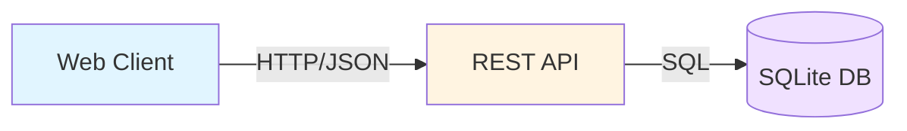
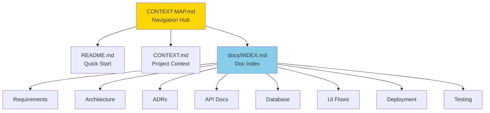

# Context Map - Friday Snack Vote

## Project Summary

**Friday Snack Vote** is a lightweight polling application for team snack preference collection. Built for Epic 190, it provides three core capabilities: create polls, vote via shareable links, and view real-time results.

## Quick Navigation

| Document | Purpose | Audience |
|----------|---------|----------|
| [README.md](README.md) | Project overview & quick start | Everyone |
| [CONTEXT.md](CONTEXT.md) | Detailed project context | Developers, PMs |
| [docs/INDEX.md](docs/INDEX.md) | Complete documentation index | Everyone |

## Architecture at a Glance



**Key Points:**
- **No Authentication**: Link-based access control
- **SQLite**: Single-file database, zero configuration
- **REST API**: Three endpoints (POST /polls, POST /polls/:id/votes, GET /polls/:id)

## Core Workflows

### 1. Create Poll
```
Organizer → POST /polls → System generates ID → Share link
```

### 2. Vote
```
Team member → Click link → Select option → POST vote → Confirmation
```

### 3. View Results
```
Anyone → GET /polls/:id → See vote counts
```

## Documentation Map

```
docs/
├── INDEX.md                          # 📚 Start here - complete navigation
│
├── requirements/
│   └── functional-requirements.md    # ✅ What the system does
│
├── architecture/
│   └── overview.md                   # 🏗️ How the system works
│
├── adr/                              # 🤔 Why decisions were made
│   ├── 001-sqlite-database.md
│   ├── 002-no-authentication.md
│   └── 003-rest-api-design.md
│
├── api/
│   └── endpoints.md                  # 🔌 API reference & examples
│
├── database/
│   └── schema.md                     # 💾 Data model & queries
│
├── ui/
│   └── user-flows.md                 # 🎨 User interaction patterns
│
├── deployment/
│   └── setup.md                      # 🚀 Installation & deployment
│
└── testing/
    └── test-plan.md                  # 🧪 Testing strategy
```

## Key Design Decisions

### Decision 1: SQLite Database
**Why**: Zero configuration, single-file storage, sufficient for team scale  
**Trade-off**: Limited write concurrency vs. operational simplicity  
**Details**: [ADR 001](docs/adr/001-sqlite-database.md)

### Decision 2: No Authentication
**Why**: Frictionless voting, faster implementation, appropriate for informal polls  
**Trade-off**: No vote attribution vs. better user experience  
**Details**: [ADR 002](docs/adr/002-no-authentication.md)

### Decision 3: REST API
**Why**: Standard conventions, stateless, works with any client  
**Trade-off**: No real-time push vs. simplicity  
**Details**: [ADR 003](docs/adr/003-rest-api-design.md)

## API Quick Reference

### Create Poll
```bash
POST /polls
{
  "title": "Friday Snack Choice",
  "options": ["Pizza", "Tacos", "Sushi"]
}
```

### Submit Vote
```bash
POST /polls/:id/votes
{
  "option_id": 2
}
```

### Get Results
```bash
GET /polls/:id
```

**Full API Documentation**: [docs/api/endpoints.md](docs/api/endpoints.md)

## Database Schema

```
polls (id, title, created_at)
  ├── options (id, poll_id, text, position)
  └── votes (id, poll_id, option_id, created_at)
```

**Full Schema**: [docs/database/schema.md](docs/database/schema.md)

## User Stories (Epic 190)

| Story | Status | Documentation |
|-------|--------|---------------|
| Create poll with options | ✅ Shipped | [Functional Requirements](docs/requirements/functional-requirements.md#story-1-create-poll) |
| Vote via shareable link | ✅ Shipped | [Functional Requirements](docs/requirements/functional-requirements.md#story-2-vote-via-link) |
| View poll results | ✅ Shipped | [Functional Requirements](docs/requirements/functional-requirements.md#story-3-see-results) |

## Technology Stack

| Layer | Technology | Rationale |
|-------|-----------|-----------|
| Database | SQLite 3.x | Zero-config, single-file, ACID compliant |
| API | REST/HTTP | Standard, stateless, universal client support |
| Data Format | JSON | Human-readable, widely supported |
| Authentication | None | Link-based access, frictionless UX |

## Getting Started

### For Developers
1. Read [README.md](README.md) for overview
2. Follow [Setup Guide](docs/deployment/setup.md) for installation
3. Review [API Endpoints](docs/api/endpoints.md) for integration
4. Check [Database Schema](docs/database/schema.md) for data model

### For Product Managers
1. Read [CONTEXT.md](CONTEXT.md) for project background
2. Review [Functional Requirements](docs/requirements/functional-requirements.md)
3. Explore [User Flows](docs/ui/user-flows.md)

### For DevOps
1. Follow [Setup Guide](docs/deployment/setup.md)
2. Review [Architecture Overview](docs/architecture/overview.md)
3. Check backup procedures in [Database Schema](docs/database/schema.md)

### For QA/Testers
1. Review [Functional Requirements](docs/requirements/functional-requirements.md)
2. Follow [Test Plan](docs/testing/test-plan.md)
3. Use [API Endpoints](docs/api/endpoints.md) for testing

## Common Tasks

| Task | Documentation |
|------|---------------|
| Run locally | [Setup Guide - Running](docs/deployment/setup.md#running-the-application) |
| Deploy to production | [Setup Guide - Deployment](docs/deployment/setup.md#deployment-options) |
| Understand API | [API Endpoints](docs/api/endpoints.md) |
| Query database | [Database Schema](docs/database/schema.md#common-queries) |
| Run tests | [Test Plan](docs/testing/test-plan.md#running-tests) |
| Troubleshoot | [Setup Guide - Troubleshooting](docs/deployment/setup.md#troubleshooting) |

## System Boundaries

### In Scope
- Poll creation with multiple options
- Anonymous voting via links
- Real-time result viewing
- SQLite data persistence

### Out of Scope
- User authentication/login
- Vote editing/deletion
- Poll expiration
- Real-time WebSocket updates
- Results visualization (charts)
- Email notifications

**Details**: [Functional Requirements - Out of Scope](docs/requirements/functional-requirements.md#out-of-scope)

## Performance Characteristics

| Metric | Target | Documentation |
|--------|--------|---------------|
| Poll creation | < 500ms | [Functional Requirements](docs/requirements/functional-requirements.md#nfr-1-performance) |
| Vote submission | < 300ms | [Functional Requirements](docs/requirements/functional-requirements.md#nfr-1-performance) |
| Results retrieval | < 200ms | [Functional Requirements](docs/requirements/functional-requirements.md#nfr-1-performance) |
| Concurrent voters | 100+ | [Architecture Overview](docs/architecture/overview.md#scalability-notes) |

## Security Model

- **Access Control**: Obscure poll IDs (not guessable)
- **Input Validation**: SQL injection prevention
- **No PII**: No personal data collected
- **HTTPS**: Recommended for production

**Details**: [Architecture Overview - Security](docs/architecture/overview.md#security-considerations)

## Epic Status

**Epic 190**: ✅ Complete  
**Stories**: 3/3 merged and shipped  
**Documentation**: Complete and reconciled

## Future Enhancements

Potential features for future iterations:
- Poll expiration dates
- Results export (CSV, PDF)
- Visual charts and graphs
- IP-based duplicate vote detection
- Admin dashboard

**Details**: [Functional Requirements - Future Enhancements](docs/requirements/functional-requirements.md#future-enhancements)

## Support & Resources

- **Documentation Index**: [docs/INDEX.md](docs/INDEX.md)
- **Repository**: joshclements518/gh-cc-test
- **Epic Issue**: #190
- **Status**: All stories merged, docs reconciled

## Document Relationships



## How to Use This Map

1. **First Time**: Start with [README.md](README.md)
2. **Deep Dive**: Read [CONTEXT.md](CONTEXT.md)
3. **Find Docs**: Use [docs/INDEX.md](docs/INDEX.md)
4. **Specific Topic**: Navigate directly to relevant doc
5. **Return Here**: Use this map to orient yourself

---

**This Document**: Navigation hub for the entire project  
**Last Updated**: 2024-01-15  
**Epic**: #190 - Friday Snack Vote  
**Status**: Complete
