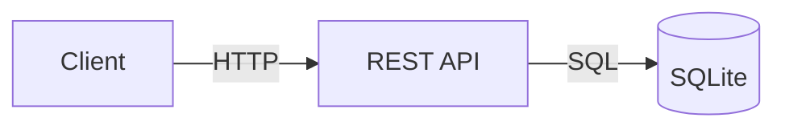

# Friday Snack Vote

A lightweight polling application for team snack preferences. Create polls, share links, and see results in real-time.

## Features

- **Create Polls**: Set up polls with multiple snack options
- **Vote via Link**: Share a link for frictionless voting (no login required)
- **View Results**: See real-time vote counts and totals

## Quick Start

### API Endpoints

The application provides three core REST endpoints:

```bash
# Create a poll
POST /polls
{
  "title": "Friday Snack Choice",
  "options": ["Pizza", "Tacos", "Sushi", "Salad"]
}

# Submit a vote
POST /polls/:id/votes
{
  "option_id": 2
}

# Get results
GET /polls/:id
```

## Architecture

- **Database**: SQLite (single-file, zero-config)
- **Authentication**: None (link-based access)
- **API**: RESTful HTTP endpoints



## Documentation

Comprehensive documentation is available in the `docs/` directory:

### Requirements
- [Functional Requirements](docs/requirements/functional-requirements.md) - User stories and acceptance criteria

### Architecture
- [Architecture Overview](docs/architecture/overview.md) - System design and data flow
- [Database Schema](docs/database/schema.md) - Table definitions and queries

### Architecture Decision Records (ADRs)
- [ADR 001: SQLite Database](docs/adr/001-sqlite-database.md)
- [ADR 002: No Authentication](docs/adr/002-no-authentication.md)
- [ADR 003: REST API Design](docs/adr/003-rest-api-design.md)

### API Reference
- [API Endpoints](docs/api/endpoints.md) - Complete API documentation with examples

### User Interface
- [User Flows](docs/ui/user-flows.md) - Interaction patterns and user journeys

## Use Case

Perfect for informal team decisions:
- Weekly snack orders
- Lunch venue selection
- Meeting time preferences
- Quick consensus gathering

## Design Principles

1. **Simplicity**: No authentication, minimal setup
2. **Speed**: Fast voting with immediate results
3. **Privacy**: No personal data collection
4. **Accessibility**: Link-based access works everywhere

## Technology Decisions

### Why SQLite?
- Zero configuration required
- Single-file database (easy backups)
- Sufficient for team-scale usage
- ACID compliant

### Why No Authentication?
- Reduces friction for voters
- Faster implementation
- Appropriate for informal team polls
- Trust-based system

### Why REST?
- Standard HTTP conventions
- Works with any client
- Easy to test and debug
- Stateless and scalable

## Example Usage

```bash
# 1. Create a poll
curl -X POST http://localhost:3000/polls \
  -H "Content-Type: application/json" \
  -d '{
    "title": "Friday Snack Choice",
    "options": ["Pizza", "Tacos", "Sushi", "Salad"]
  }'

# Response includes poll ID and shareable link
# {"id": "abc123xyz", "vote_url": "/polls/abc123xyz", ...}

# 2. Share the link with your team
# Team members vote by posting to /polls/abc123xyz/votes

# 3. View results
curl http://localhost:3000/polls/abc123xyz
```

## Project Status

**Epic 190**: All stories merged and shipped
- ✅ Create poll functionality
- ✅ Vote via link
- ✅ View results

## Contributing

This project follows a structured development process:
- Requirements documented in `docs/requirements/`
- Architecture decisions recorded in `docs/adr/`
- API contracts defined in `docs/api/`

## License

[Add license information]

## Support

For questions or issues, please refer to the documentation or contact the development team.
