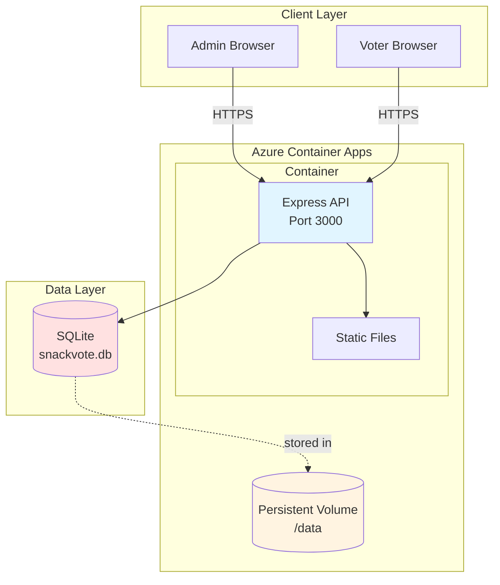
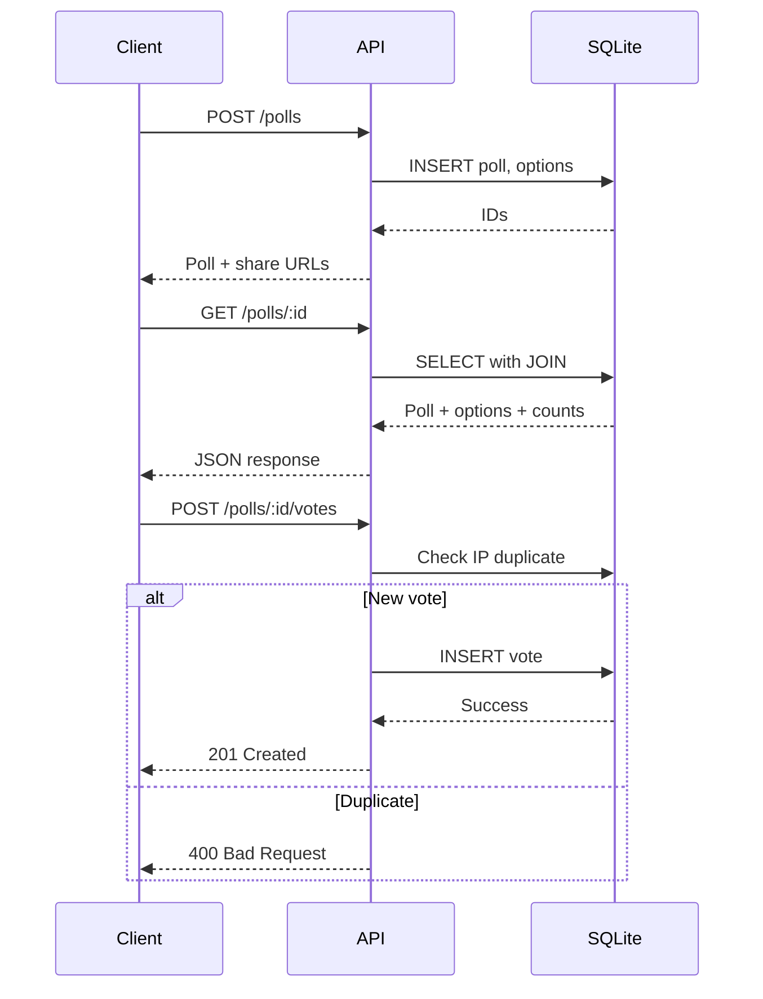

# Architecture Overview — Friday Snack Vote

## System Summary
The Friday Snack Vote is a minimal internal polling application built with Node.js, SQLite, and deployed on Azure Container Apps. It enables friction-free team voting on snack preferences via shared links.

## Architecture Documents
- **[system-context.md](system-context.md)** - High-level system diagram and components
- **[data-model.md](data-model.md)** - Entity relationships and database schema
- **[api-spec.md](api-spec.md)** - REST API endpoints and contracts
- **[deployment.md](deployment.md)** - Azure Container Apps configuration

## Core Architecture

### Technology Stack
| Layer | Technology | Rationale |
|-------|-----------|-----------|
| Runtime | Node.js 18 | Lightweight, fast startup |
| Framework | Express | Simple REST API |
| Database | SQLite 3 | Zero-config, embedded |
| Hosting | Azure Container Apps | Managed containers, auto-HTTPS |
| Storage | Azure File Share | Persistent volume for DB |

### System Architecture



## API Surface

### Endpoints
```
POST   /polls           Create poll with options
GET    /polls/:id       Get poll details + vote counts
POST   /polls/:id/votes Cast vote for option
GET    /health          Health check
```

### Request Flow


## Data Model

### Schema
```
polls
  - id (PK)
  - title
  - created_at
  - admin_token

options
  - id (PK)
  - poll_id (FK → polls)
  - name
  - display_order

votes
  - id (PK)
  - option_id (FK → options)
  - voted_at
  - voter_ip (hashed)
```

## Key Design Decisions

### 1. SQLite Storage ([ADR-001](../adr/001-sqlite-storage.md))
- **Why:** Simple, fast, no network overhead
- **Trade-off:** Single-instance scaling only
- **Mitigation:** Persistent volume for data durability

### 2. No Voter Authentication ([ADR-002](../adr/002-no-voter-auth.md))
- **Why:** Minimize friction, internal low-stakes use
- **Trade-off:** Possible duplicate votes from different IPs
- **Mitigation:** IP-based duplicate prevention

### 3. Single Container Instance
- **Why:** SQLite requires single writer
- **Implication:** Vertical scaling only (CPU/memory)
- **Future:** Migrate to PostgreSQL if horizontal scaling needed

## Deployment Architecture

### Azure Container Apps
```yaml
Container:
  - Image: Node.js 18 Alpine
  - Resources: 0.25 CPU, 0.5Gi memory
  - Replicas: 1 (fixed)
  - Port: 3000

Volume:
  - Type: Azure File Share
  - Mount: /data
  - Contains: snackvote.db

Ingress:
  - External: true
  - HTTPS: managed certificate
  - Target: port 3000
```

### Data Persistence
- SQLite file stored at `/data/snackvote.db`
- Azure File Share mounted to container
- Survives container restarts
- Manual backup via `sqlite3 .dump`

## Security Model

### Authentication
- **Admin:** Magic link tokens (24h expiry)
- **Voters:** None (anonymous access)

### Data Protection
- HTTPS-only communication
- IP addresses hashed before storage
- No PII collected from voters
- Database file permissions: 600

### Rate Limiting
- 1 vote per IP per poll
- Basic duplicate prevention
- Future: Add CAPTCHA if abuse detected

## Scalability

### Current Limits
- **Concurrent Users:** ~100 simultaneous voters
- **Polls:** Unlimited (storage-bound)
- **Votes per Poll:** ~10,000 (performance-tested)

### Scaling Options
- **Vertical:** Increase container CPU/memory
- **Horizontal:** Requires PostgreSQL migration
- **Caching:** Add Redis for read-heavy loads

## Monitoring

### Health Checks
```
GET /health
→ 200 OK: {"status":"healthy","database":"connected"}
```

### Observability
- Application logs: Azure Container Apps log stream
- Metrics: CPU, memory, request count
- Alerts: Health check failures, high error rate

## Future Considerations
- Multiple simultaneous polls
- Poll scheduling/expiration
- Vote editing/retraction
- Export results to CSV
- Integration with Slack/Teams
