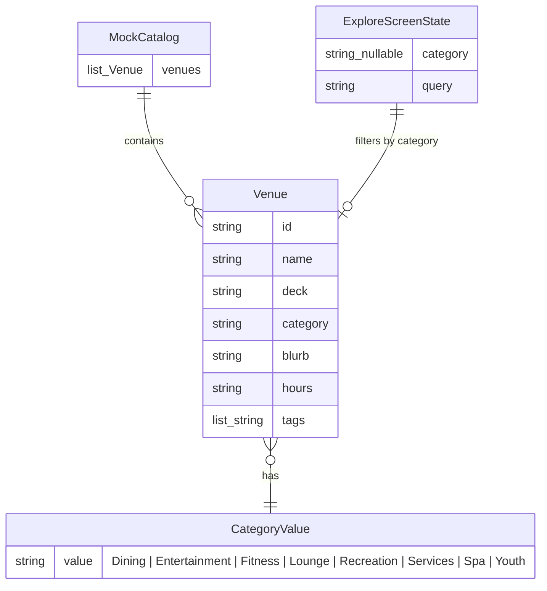

# Data Model — Wellness Filter Chip

This diagram shows the Venue model and how the Wellness filter relates to existing category values.

**Wellness filter mapping:**
- **Wellness is NOT a venue category** — it remains a UI-only filter concept
- Chart Room Spa has `category: "Spa"`
- Fitness Studio has `category: "Fitness"`
- When Wellness chip is selected, `ExploreScreenState.category` will be set to a special value (e.g., `"Wellness"`)
- The filter logic must recognize `"Wellness"` and match venues where `category == "Spa" || category == "Fitness"`

**No data model changes:**
- Venue model remains unchanged
- MockCatalog venue data remains unchanged
- Only the filtering logic in `ExploreScreen._ExploreScreenState.filtered` getter changes
