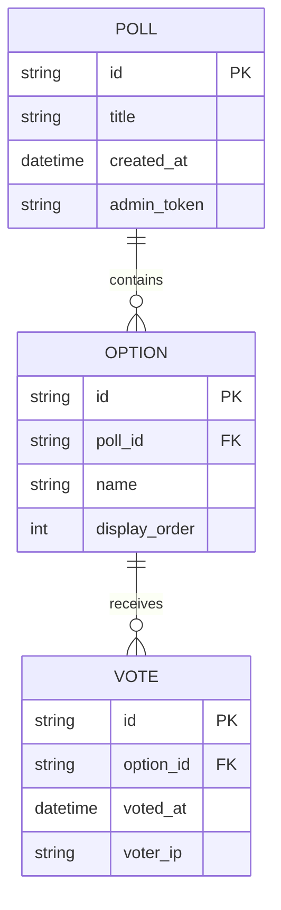

# Data Model — Friday Snack Vote

## Entity Relationship Diagram

## Entities

### Poll
Represents a single snack poll instance.

| Field | Type | Description |
|-------|------|-------------|
| id | string (UUID) | Primary key |
| title | string | Poll question/title |
| created_at | datetime | Creation timestamp |
| admin_token | string | Magic link token for admin access |

### Option
A snack choice within a poll.

| Field | Type | Description |
|-------|------|-------------|
| id | string (UUID) | Primary key |
| poll_id | string | Foreign key to Poll |
| name | string | Snack option name |
| display_order | integer | Sort order for display |

### Vote
A single vote cast for an option.

| Field | Type | Description |
|-------|------|-------------|
| id | string (UUID) | Primary key |
| option_id | string | Foreign key to Option |
| voted_at | datetime | Vote timestamp |
| voter_ip | string | IP address (basic duplicate prevention) |

## Storage Implementation
- **Database:** SQLite 3
- **Location:** `/data/snackvote.db` on ACA container
- **Indexes:** 
  - `poll_id` on Options table
  - `option_id` on Votes table
