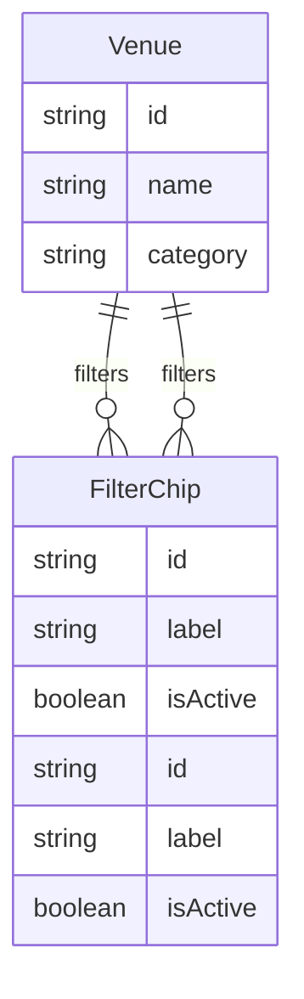

```mermaid
erDiagram
    Venue {
        string id
        string name
        string category
    }
    FilterChip {
        string id
        string label
        boolean isActive
    }
    Venue ||--o{ FilterChip : filters
    Venue ||--o{ FilterChip : filters
    FilterChip {
        string id
        string label
        boolean isActive
    }
    %% added

```