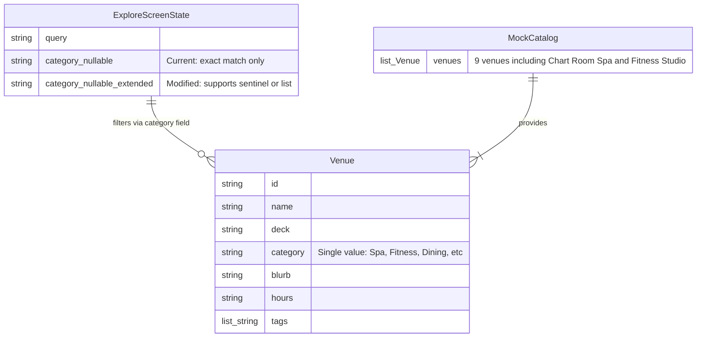

# Data Model — Wellness Filter Chip



## Notes

- **Venue.category** is a single string field, not a list. Each venue belongs to exactly one category.
- **Chart Room Spa** has `category: "Spa"` (id: v5)
- **Fitness Studio** has `category: "Fitness"` (id: v8)
- **ExploreScreenState.category** is currently `String?` where `null` means "All" and any other value matches exactly one category.
- The Wellness filter must match venues where `category == "Spa" OR category == "Fitness"` using the existing single-value category field.

## Architectural Decision

The Wellness filter implementation uses a **sentinel value approach** (see ADR-001). The `String? category` state variable accepts a special value `"Wellness"`, and the filter getter contains conditional logic to expand it to an OR condition:

```dart
final matchesC = category == null || 
                 (category == "Wellness" ? (v.category == "Spa" || v.category == "Fitness") : v.category == category);
```

This approach:
- Preserves the existing `String?` state contract
- Requires minimal code changes (one conditional in the filter getter)
- Maintains consistency with existing chip selection logic
- Couples the UI label "Wellness" to filter logic (documented trade-off)

See `docs/adr/ADR-001-wellness-filter-state-representation.md` for full rationale and alternatives considered.
