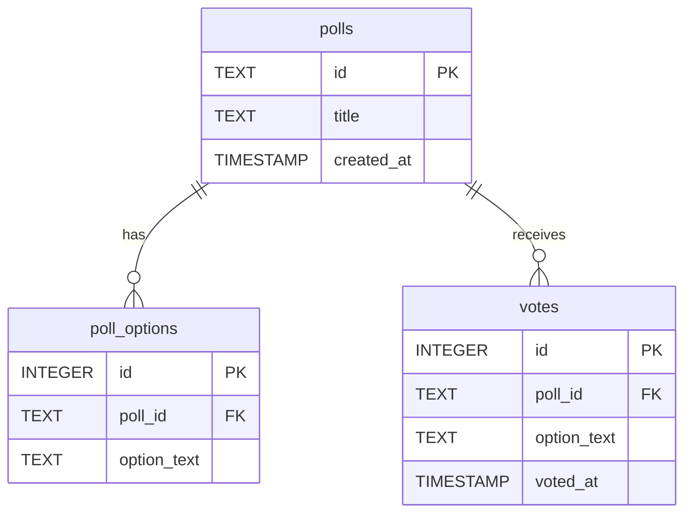

# Database Schema — Friday Snack Vote

## SQLite Schema

### Tables

#### polls
Stores poll metadata and configuration.

```sql
CREATE TABLE polls (
    id TEXT PRIMARY KEY,
    title TEXT NOT NULL,
    created_at TIMESTAMP DEFAULT CURRENT_TIMESTAMP
);
```

**Columns:**
- `id` (TEXT, PRIMARY KEY) - Unique poll identifier
- `title` (TEXT, NOT NULL) - Poll question/title
- `created_at` (TIMESTAMP) - Poll creation timestamp

---

#### poll_options
Stores available options for each poll.

```sql
CREATE TABLE poll_options (
    id INTEGER PRIMARY KEY AUTOINCREMENT,
    poll_id TEXT NOT NULL,
    option_text TEXT NOT NULL,
    FOREIGN KEY (poll_id) REFERENCES polls(id) ON DELETE CASCADE
);
```

**Columns:**
- `id` (INTEGER, PRIMARY KEY) - Auto-incrementing option ID
- `poll_id` (TEXT, NOT NULL) - Reference to parent poll
- `option_text` (TEXT, NOT NULL) - The option text

**Indexes:**
```sql
CREATE INDEX idx_poll_options_poll_id ON poll_options(poll_id);
```

---

#### votes
Stores individual vote records.

```sql
CREATE TABLE votes (
    id INTEGER PRIMARY KEY AUTOINCREMENT,
    poll_id TEXT NOT NULL,
    option_text TEXT NOT NULL,
    voted_at TIMESTAMP DEFAULT CURRENT_TIMESTAMP,
    FOREIGN KEY (poll_id) REFERENCES polls(id) ON DELETE CASCADE
);
```

**Columns:**
- `id` (INTEGER, PRIMARY KEY) - Auto-incrementing vote ID
- `poll_id` (TEXT, NOT NULL) - Reference to poll
- `option_text` (TEXT, NOT NULL) - The selected option
- `voted_at` (TIMESTAMP) - Vote submission timestamp

**Indexes:**
```sql
CREATE INDEX idx_votes_poll_id ON votes(poll_id);
```

---

## Entity Relationship Diagram



## Queries

### Create Poll
```sql
INSERT INTO polls (id, title) VALUES (?, ?);
INSERT INTO poll_options (poll_id, option_text) VALUES (?, ?);
```

### Submit Vote
```sql
INSERT INTO votes (poll_id, option_text) VALUES (?, ?);
```

### Get Poll Results
```sql
SELECT 
    p.id,
    p.title,
    p.created_at,
    po.option_text,
    COUNT(v.id) as vote_count
FROM polls p
LEFT JOIN poll_options po ON p.id = po.poll_id
LEFT JOIN votes v ON p.id = v.poll_id AND po.option_text = v.option_text
WHERE p.id = ?
GROUP BY p.id, po.option_text
ORDER BY po.id;
```

## Design Notes
- **No user tracking**: Votes are anonymous; no user_id column
- **Denormalized votes**: `option_text` stored directly in votes table for simplicity
- **Cascade deletes**: Removing a poll removes all associated options and votes
- **Indexes**: Added on foreign keys for query performance
