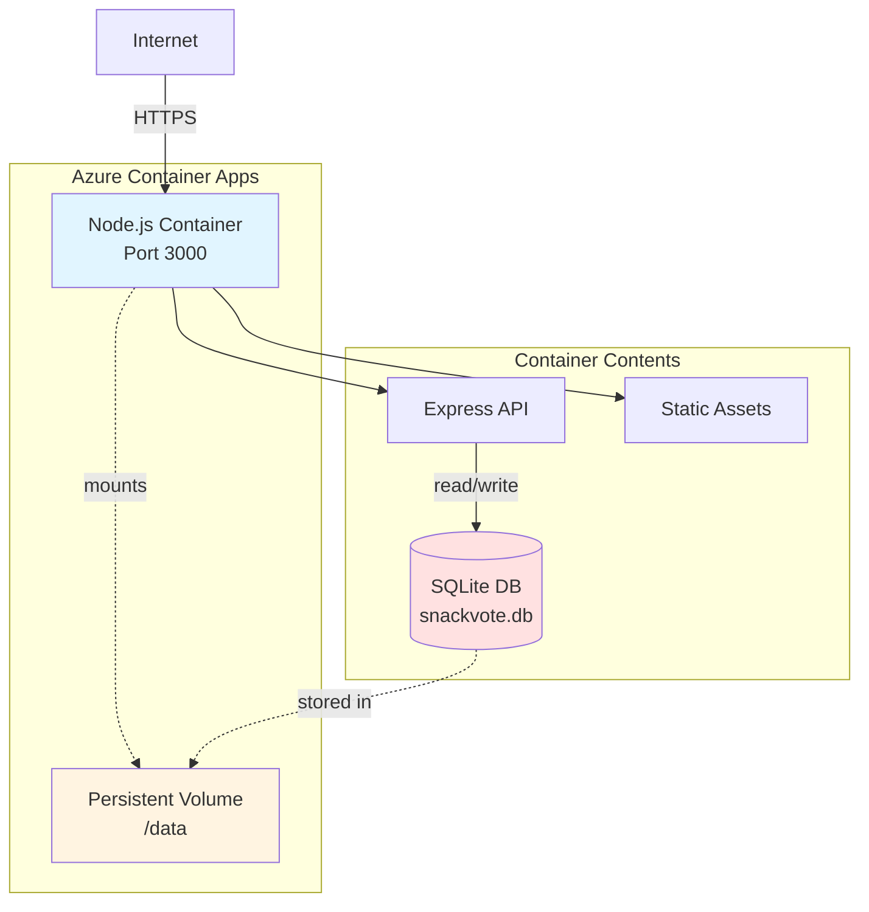

# Deployment Architecture — Friday Snack Vote

## Deployment Diagram



## Azure Container Apps Configuration

### Container Specification
```yaml
name: snack-vote-app
image: <registry>/snack-vote:latest
resources:
  cpu: 0.25
  memory: 0.5Gi
scale:
  minReplicas: 1
  maxReplicas: 1  # Single instance for SQLite
```

### Environment Variables
```bash
NODE_ENV=production
PORT=3000
DB_PATH=/data/snackvote.db
ADMIN_EMAIL=team-admin@company.com
```

### Volume Mount
```yaml
volumes:
  - name: data-volume
    storageType: AzureFile
    storageName: snackvote-storage
    
volumeMounts:
  - volumeName: data-volume
    mountPath: /data
```

### Ingress Configuration
```yaml
ingress:
  external: true
  targetPort: 3000
  transport: http
  allowInsecure: false
```

## Container Image

### Dockerfile Structure
```dockerfile
FROM node:18-alpine
WORKDIR /app
COPY package*.json ./
RUN npm ci --production
COPY . .
RUN mkdir -p /data
EXPOSE 3000
CMD ["node", "server.js"]
```

### Build & Push
```bash
# Build image
docker build -t snack-vote:latest .

# Tag for registry
docker tag snack-vote:latest <registry>/snack-vote:latest

# Push to Azure Container Registry
docker push <registry>/snack-vote:latest
```

## Deployment Process

### Initial Deployment
1. Create Azure Container Apps environment
2. Provision Azure File Share for persistence
3. Build and push container image
4. Deploy container app with volume mount
5. Verify database initialization
6. Test endpoints

### Updates
1. Build new container image with version tag
2. Push to registry
3. Update container app revision
4. ACA performs rolling update
5. Verify health check passes

## Monitoring & Operations

### Health Check
**Endpoint:** `GET /health`

**Response:**
```json
{
  "status": "healthy",
  "database": "connected",
  "uptime": 3600
}
```

### Logs
- Application logs: Azure Container Apps log stream
- Access logs: Ingress logs
- Database: SQLite query logs (if enabled)

### Backup Strategy
```bash
# Manual backup
az containerapp exec \
  --name snack-vote-app \
  --command "sqlite3 /data/snackvote.db .dump > /data/backup.sql"

# Scheduled backup (Azure Function)
# Runs daily, copies DB file to Blob Storage
```

## Scaling Considerations

### Current Limitations
- **Single Instance:** SQLite requires single writer
- **Vertical Scaling:** Can increase CPU/memory if needed
- **Read Replicas:** Not applicable with SQLite

### Future Migration Path
If horizontal scaling needed:
1. Migrate to PostgreSQL on Azure
2. Update connection string
3. Enable multi-replica scaling
4. Add connection pooling

## Security

### Network
- HTTPS only (ACA managed certificates)
- No public database port
- Internal container network

### Secrets
- Admin email in environment variable
- Magic link tokens generated at runtime
- No hardcoded credentials

### Data Protection
- Database file permissions: 600
- Volume access restricted to container
- IP addresses hashed before storage
