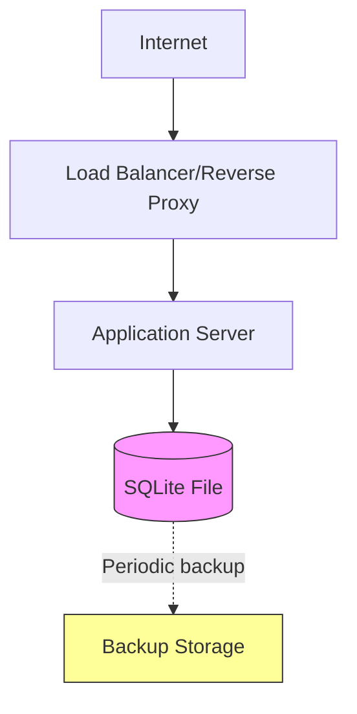

# Deployment Guide — Friday Snack Vote

## Overview
This document outlines deployment considerations and operational requirements for the Friday Snack Vote application.

## System Requirements

### Minimum Requirements
- **Runtime**: Any environment supporting the chosen backend language
- **Database**: SQLite 3.x (typically bundled with runtime)
- **Storage**: ~10MB for application + database file
- **Memory**: 128MB minimum
- **CPU**: Single core sufficient

### Recommended Requirements
- **Memory**: 256MB for comfortable operation
- **Storage**: 100MB (allows for growth)
- **Backup**: Regular database file backups

## Deployment Architecture



## Deployment Options

### Option 1: Single Server (Recommended)
**Best for**: Internal team use, low to medium traffic

```
[Application Server]
├── Application process
└── SQLite database file
```

**Pros:**
- Simple setup
- Low cost
- Easy maintenance
- Sufficient for expected load

**Cons:**
- Single point of failure
- Limited scalability

### Option 2: Container Deployment
**Best for**: Cloud environments, easy scaling

```yaml
# Example Docker setup
services:
  app:
    image: friday-snack-vote:latest
    ports:
      - "8080:8080"
    volumes:
      - ./data:/app/data  # SQLite database
```

**Pros:**
- Portable
- Easy to update
- Consistent environments

**Cons:**
- Requires volume management for database persistence

### Option 3: Serverless (Not Recommended)
**Note**: SQLite requires persistent file system, making serverless deployment challenging without modifications.

## Configuration

### Environment Variables
```bash
# Database
DATABASE_PATH=/app/data/polls.db

# Server
PORT=8080
HOST=0.0.0.0

# Optional
LOG_LEVEL=info
CORS_ORIGIN=*
```

### Database Location
- **Development**: `./polls.db` (local directory)
- **Production**: `/var/lib/friday-snack-vote/polls.db` (persistent volume)

## Database Management

### Initialization
```bash
# Database is created automatically on first run
# Schema is applied via migrations or initialization script
```

### Backup Strategy
```bash
# Simple file copy (SQLite allows hot backup)
cp /var/lib/friday-snack-vote/polls.db /backup/polls-$(date +%Y%m%d).db

# Or use SQLite backup command
sqlite3 polls.db ".backup /backup/polls-backup.db"
```

**Recommended Schedule:**
- Daily backups retained for 7 days
- Weekly backups retained for 4 weeks
- Monthly backups retained for 1 year

### Restore
```bash
# Stop application
systemctl stop friday-snack-vote

# Restore database
cp /backup/polls-20240115.db /var/lib/friday-snack-vote/polls.db

# Start application
systemctl start friday-snack-vote
```

## Monitoring

### Health Check Endpoint
```bash
# Recommended: Add health check endpoint
GET /health
Response: 200 OK
```

### Key Metrics to Monitor
1. **Application Health**
   - HTTP response times
   - Error rates (4xx, 5xx)
   - Request throughput

2. **Database Health**
   - Database file size
   - Query performance
   - Write lock contention

3. **System Resources**
   - CPU usage
   - Memory usage
   - Disk space

### Logging
```
# Recommended log format (JSON)
{
  "timestamp": "2024-01-15T10:30:00Z",
  "level": "info",
  "message": "Poll created",
  "poll_id": "abc123",
  "options_count": 4
}
```

## Security Considerations

### Network Security
- Deploy behind reverse proxy (nginx, Apache)
- Use HTTPS in production
- Configure CORS appropriately

### Database Security
- Restrict file system permissions (600 or 640)
- Regular backups to secure location
- No sensitive data stored (anonymous voting)

### API Security
- Rate limiting recommended (prevent spam)
- Input validation on all endpoints
- SQL injection prevention (use parameterized queries)

## Scaling Considerations

### When to Scale Up
Monitor for these indicators:
- Response times > 500ms consistently
- Database write lock timeouts
- CPU usage > 80% sustained

### Scaling Options

**Vertical Scaling** (Recommended first step)
- Increase server resources
- SQLite performs well with more CPU/memory

**Horizontal Scaling** (Requires changes)
- Migrate to PostgreSQL or MySQL
- Add read replicas
- Load balance across multiple servers

## Troubleshooting

### Common Issues

**Database Locked**
```
Error: database is locked
```
**Solution**: Reduce concurrent writes or increase timeout
```python
# Example: Increase timeout
connection.execute("PRAGMA busy_timeout = 5000")
```

**Database Corruption**
```
Error: database disk image is malformed
```
**Solution**: Restore from backup
```bash
cp /backup/polls-latest.db /var/lib/friday-snack-vote/polls.db
```

**High Memory Usage**
**Solution**: Check for connection leaks, ensure connections are closed

## Maintenance

### Regular Tasks
- **Daily**: Check logs for errors
- **Weekly**: Review disk space and database size
- **Monthly**: Test backup restoration
- **Quarterly**: Review performance metrics

### Updates
1. Test update in staging environment
2. Backup production database
3. Deploy new version
4. Verify health check
5. Monitor for errors

## Disaster Recovery

### Recovery Time Objective (RTO)
Target: < 1 hour

### Recovery Point Objective (RPO)
Target: < 24 hours (daily backups)

### Recovery Procedure
1. Provision new server (if needed)
2. Deploy application
3. Restore latest database backup
4. Verify functionality
5. Update DNS (if server changed)

## Cost Estimation

### Small Deployment (< 1000 votes/day)
- **Server**: $5-10/month (small VPS)
- **Backup**: $1-2/month (object storage)
- **Total**: ~$10/month

### Medium Deployment (< 10,000 votes/day)
- **Server**: $20-40/month (medium VPS)
- **Backup**: $2-5/month
- **Monitoring**: $10/month (optional)
- **Total**: ~$40/month

## Production Checklist

- [ ] HTTPS configured
- [ ] Database backups automated
- [ ] Monitoring and alerting set up
- [ ] Log aggregation configured
- [ ] Health check endpoint implemented
- [ ] Rate limiting enabled
- [ ] CORS configured appropriately
- [ ] Error tracking enabled
- [ ] Documentation updated
- [ ] Disaster recovery plan tested

## Support

For deployment issues:
1. Check application logs
2. Verify database file permissions
3. Review system resource usage
4. Consult architecture documentation
