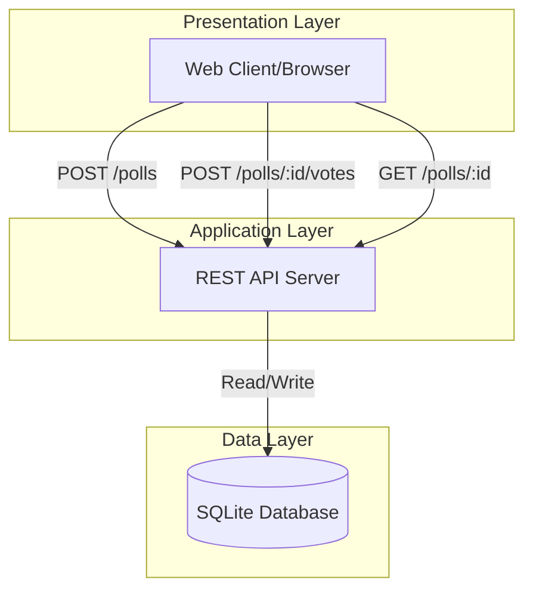
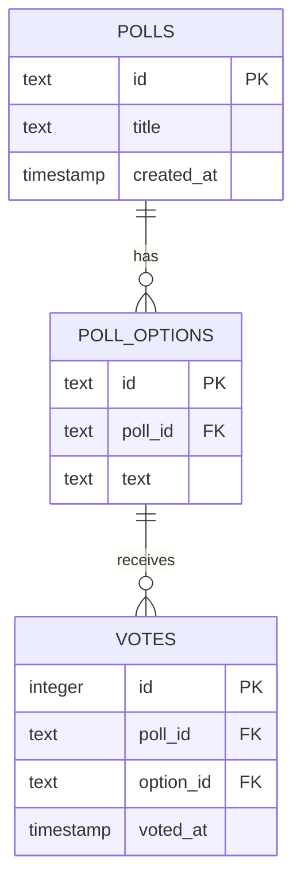

# Architecture: Friday Snack Vote System

## System Overview
The Friday Snack Vote is a lightweight polling application built with a simple REST API backend and SQLite database.

## Architecture Diagram



## Technology Stack

### Backend
- **Runtime**: Node.js / Python / Go (implementation-specific)
- **Database**: SQLite
- **API Style**: REST

### Data Storage
- **SQLite** chosen for:
  - Zero configuration
  - Single-file portability
  - Sufficient for expected load
  - No separate database server required

## API Endpoints

### 1. Create Poll
**Endpoint**: `POST /polls`

**Request Body**:
```json
{
  "title": "What snack should we get this Friday?",
  "options": ["Pizza", "Tacos", "Sushi", "Burgers"]
}
```

**Response** (201 Created):
```json
{
  "id": "abc123",
  "title": "What snack should we get this Friday?",
  "options": [
    {"id": "opt1", "text": "Pizza", "votes": 0},
    {"id": "opt2", "text": "Tacos", "votes": 0},
    {"id": "opt3", "text": "Sushi", "votes": 0},
    {"id": "opt4", "text": "Burgers", "votes": 0}
  ],
  "createdAt": "2024-01-15T10:00:00Z",
  "link": "/polls/abc123"
}
```

### 2. Submit Vote
**Endpoint**: `POST /polls/:id/votes`

**Request Body**:
```json
{
  "optionId": "opt2"
}
```

**Response** (200 OK):
```json
{
  "success": true,
  "pollId": "abc123",
  "optionId": "opt2"
}
```

**Error Response** (404 Not Found):
```json
{
  "error": "Poll not found"
}
```

**Error Response** (400 Bad Request):
```json
{
  "error": "Invalid option"
}
```

### 3. Get Poll Results
**Endpoint**: `GET /polls/:id`

**Response** (200 OK):
```json
{
  "id": "abc123",
  "title": "What snack should we get this Friday?",
  "options": [
    {"id": "opt1", "text": "Pizza", "votes": 5},
    {"id": "opt2", "text": "Tacos", "votes": 12},
    {"id": "opt3", "text": "Sushi", "votes": 3},
    {"id": "opt4", "text": "Burgers", "votes": 8}
  ],
  "totalVotes": 28,
  "createdAt": "2024-01-15T10:00:00Z"
}
```

**Error Response** (404 Not Found):
```json
{
  "error": "Poll not found"
}
```

## Data Model

### Database Schema

```sql
-- Polls table
CREATE TABLE polls (
    id TEXT PRIMARY KEY,
    title TEXT NOT NULL,
    created_at TIMESTAMP DEFAULT CURRENT_TIMESTAMP
);

-- Poll options table
CREATE TABLE poll_options (
    id TEXT PRIMARY KEY,
    poll_id TEXT NOT NULL,
    text TEXT NOT NULL,
    FOREIGN KEY (poll_id) REFERENCES polls(id)
);

-- Votes table
CREATE TABLE votes (
    id INTEGER PRIMARY KEY AUTOINCREMENT,
    poll_id TEXT NOT NULL,
    option_id TEXT NOT NULL,
    voted_at TIMESTAMP DEFAULT CURRENT_TIMESTAMP,
    FOREIGN KEY (poll_id) REFERENCES polls(id),
    FOREIGN KEY (option_id) REFERENCES poll_options(id)
);
```

### Entity Relationships



## Security Considerations

### No Authentication
- **Decision**: No voter authentication required
- **Rationale**: Simplicity and ease of use for internal team polls
- **Trade-off**: Vulnerable to vote manipulation
- **Mitigation**: Rate limiting, IP-based throttling (optional)

### Input Validation
- Poll titles: max 200 characters
- Options: 2-10 options per poll
- Option text: max 100 characters each

### Rate Limiting
- Create poll: 10 requests per IP per hour
- Submit vote: 1 vote per IP per poll (optional enforcement)
- Get results: 100 requests per IP per minute

## Deployment Considerations

### File Storage
- SQLite database file location: `./data/polls.db`
- Ensure write permissions for application user
- Regular backups recommended

### Scalability
- Single-instance deployment sufficient for team use
- SQLite handles concurrent reads well
- Write contention minimal for expected load (<100 concurrent voters)

### Monitoring
- Log all API requests
- Track error rates per endpoint
- Monitor database file size growth
