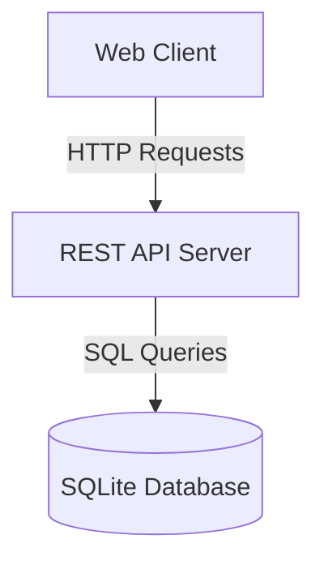
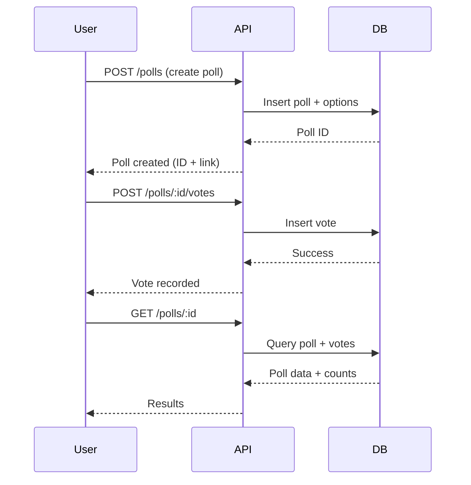

# Architecture Overview - Friday Snack Vote

## System Overview

The Friday Snack Vote application is a lightweight polling system designed to collect team preferences for Friday snacks. The system allows users to create polls, vote via shareable links, and view real-time results.

## High-Level Architecture

## Technology Stack

- **Database**: SQLite
- **Authentication**: None (anonymous voting via links)
- **API Style**: RESTful HTTP endpoints

## Core Components

### 1. Poll Management
- Create new polls with multiple options
- Store poll metadata and options in SQLite

### 2. Voting System
- Accept votes via POST requests
- No authentication required (link-based access)
- Track votes per poll option

### 3. Results Display
- Real-time vote tallies
- Retrieve poll details and current vote counts

## Data Flow

## Security Considerations

- **No Authentication**: System relies on obscure poll IDs for access control
- **Anonymous Voting**: No user tracking or identity verification
- **Link Sharing**: Poll access controlled via shareable URLs

## Scalability Notes

- SQLite suitable for small-to-medium team usage
- Single-file database simplifies deployment
- Consider migration to PostgreSQL/MySQL for larger deployments
