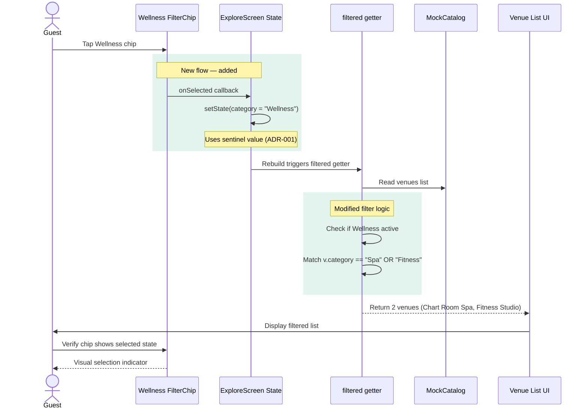

# Sequence — Wellness Filter Selection Flow



## Flow Notes

- **Current behavior**: Tapping any category chip sets `category = <categoryName>` and the filter checks `v.category == category`
- **Wellness behavior**: Tapping Wellness sets `category = "Wellness"` (sentinel value per ADR-001), and the filter getter expands this to match both "Spa" and "Fitness" categories
- **Chip selection visual**: The `selected` prop on FilterChip uses `selected: category == "Wellness"` (per ADR-002)
- **Deselection**: Tapping another chip (e.g., "Dining" or "All") changes `category` to a different value, automatically deselecting Wellness

## Implementation Details

The Wellness chip is added to the horizontal chip row with the following structure:

```dart
FilterChip(
  label: const Text('Wellness'),
  selected: category == "Wellness",
  onSelected: (_) => setState(() => category = "Wellness"),
)
```

The filter getter in `ExploreScreen` is modified to detect the sentinel:

```dart
final matchesC = category == null || 
                 (category == "Wellness" ? (v.category == "Spa" || v.category == "Fitness") : v.category == category);
```

See ADR-001 and ADR-002 for architectural rationale.
