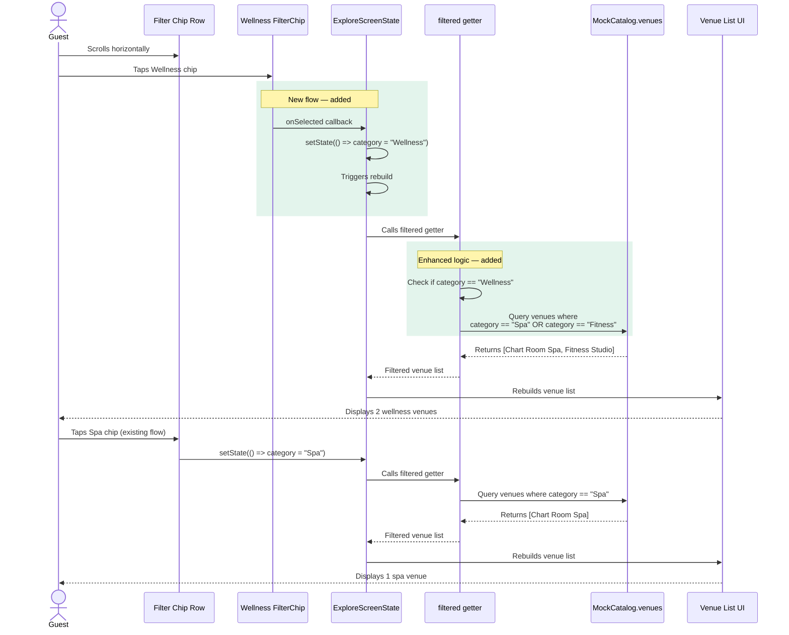

# Sequence — Wellness Filter Selection

This diagram shows the interaction flow when a guest selects the Wellness filter chip.

**Key interaction points:**
1. Guest taps Wellness chip → `category` state set to `"Wellness"`
2. Filter logic detects `"Wellness"` and applies OR condition (`Spa || Fitness`)
3. Two venues match: Chart Room Spa and Fitness Studio
4. Selecting any other chip (Spa, All, etc.) deselects Wellness via single-select behavior
5. Existing category chips continue to work unchanged (direct category match)

**Single-select enforcement:**
- Flutter's FilterChip widget handles visual selection state
- Each chip's `selected` property checks `category == chipValue`
- Wellness chip: `selected: category == "Wellness"`
- Spa chip: `selected: category == "Spa"`
- Only one chip can be selected at a time
