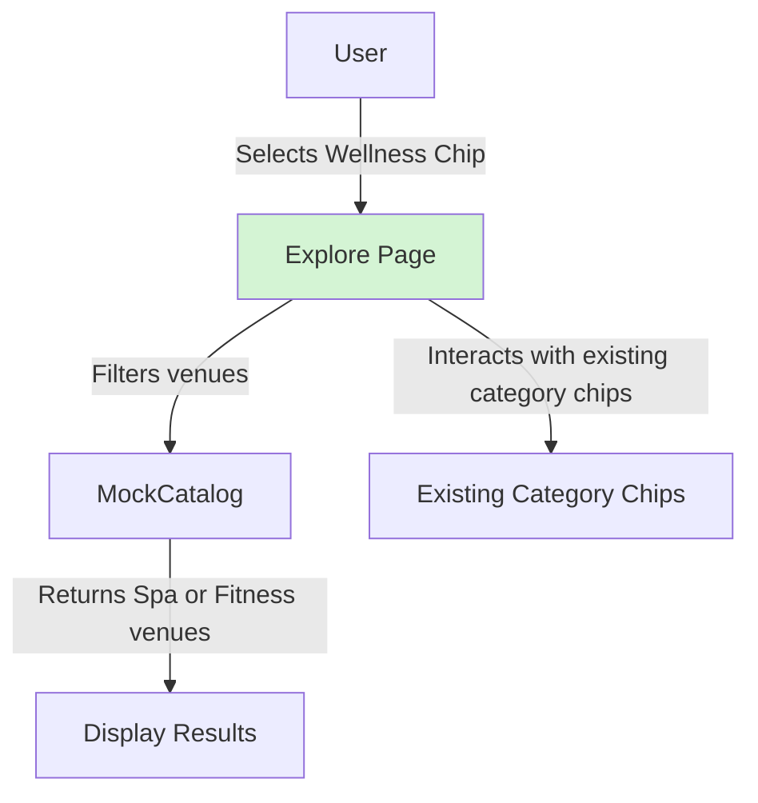

```mermaid
flowchart TD
    A["User"] -->|"Selects Wellness Chip"| B["Explore Page"]
    B -->|"Filters venues"| C["MockCatalog"]
    C -->|"Returns Spa or Fitness venues"| D["Display Results"]
    B -->|"Interacts with existing category chips"| E["Existing Category Chips"]
    classDef added fill:#d4f4d4;
    class B added;
```