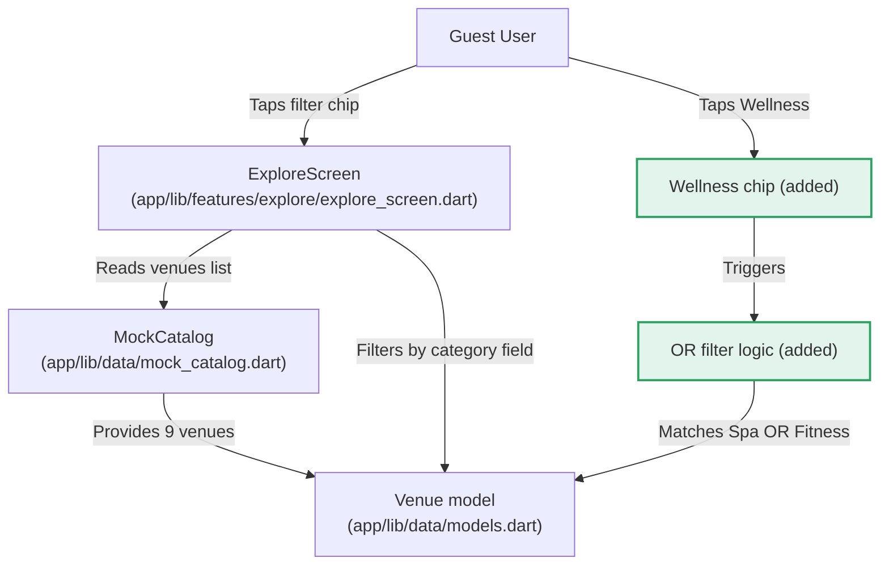

# System Context — Wellness Filter Chip

## Context

The Harborline Navigator app's Explore screen currently filters venues by a single category using exact string matching. The Wellness filter chip extends this to support a logical OR condition matching two categories (Spa OR Fitness) while preserving the existing single-select chip behavior.

**Key constraint**: The existing `String? category` state variable and `v.category == category` filter logic must be extended to support the Wellness multi-category match without breaking existing single-category chips.
