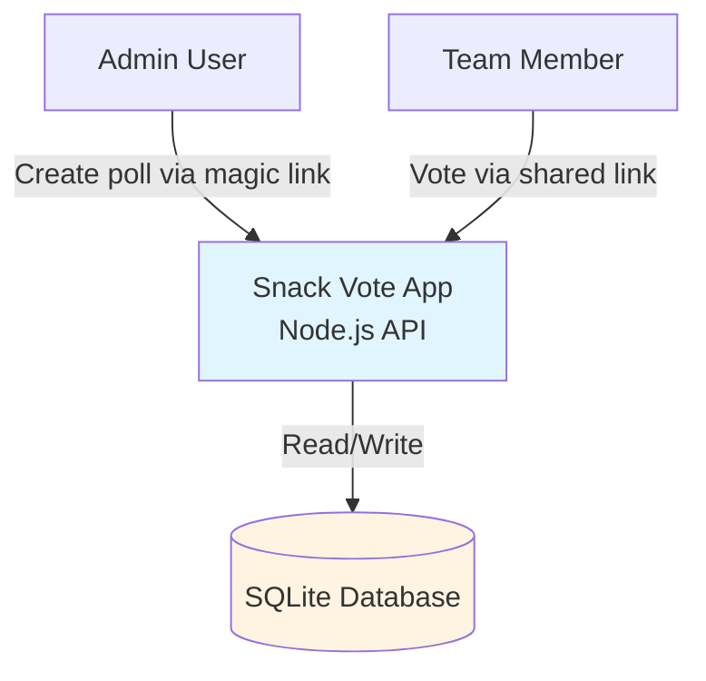

# System Context — Friday Snack Vote

## Overview
The Friday Snack Vote system is a minimal internal polling application designed for quick, anonymous team voting on snack preferences.

## System Context Diagram

## Components

### Node.js API Server
- Handles poll creation, voting, and results
- Serves static frontend assets
- Manages magic link authentication for admins

### SQLite Database
- Stores polls, options, and votes
- Runs on Azure Container Apps (ACA) instance
- Single-file persistence

### Frontend (Desktop Web)
- Poll creation interface (admin)
- Voting interface (public)
- Results display

## Key Characteristics
- **Deployment:** Azure Container Apps
- **Storage:** SQLite (local to container)
- **Authentication:** Magic links for admins only
- **Access:** Shared links for voters (no auth)
