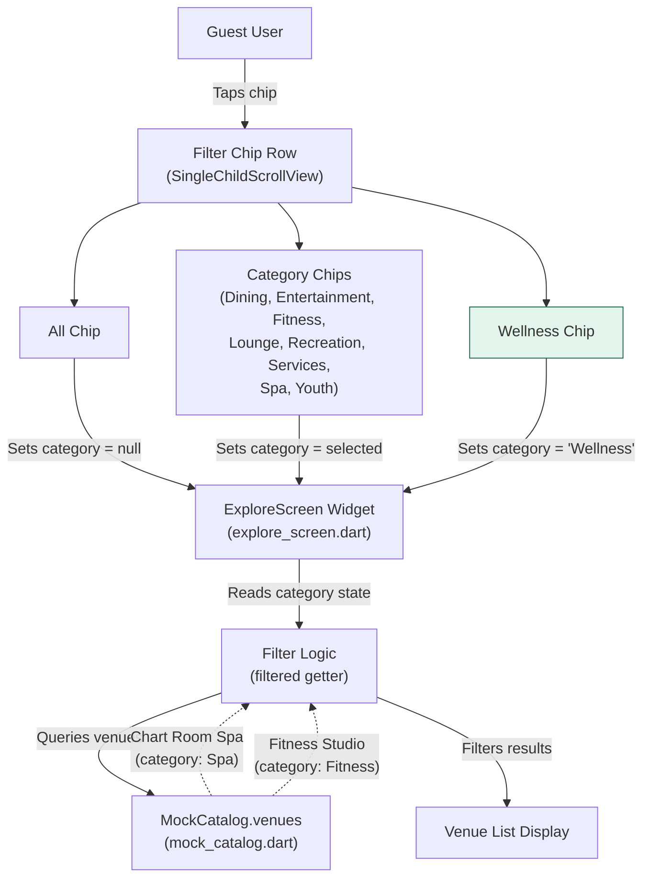

# System Context — Wellness Filter Chip

This diagram shows the Explore screen's filter chip architecture and how the Wellness chip integrates with the existing single-select category filtering system.

**Key architectural elements:**
- **ExploreScreen** maintains `category` state (String?) that drives filtering
- **Filter chip row** is a horizontal scrollable list of single-select FilterChip widgets
- **Wellness chip** is added to the existing chip row alongside All and category chips
- **Filter logic** in the `filtered` getter currently matches `v.category == category`
- **MockCatalog** provides static venue data with category field (Spa, Fitness, etc.)

**Change scope:**
- Green node (Wellness Chip) is the new UI element
- Filter logic must be enhanced to handle the Wellness pseudo-category
