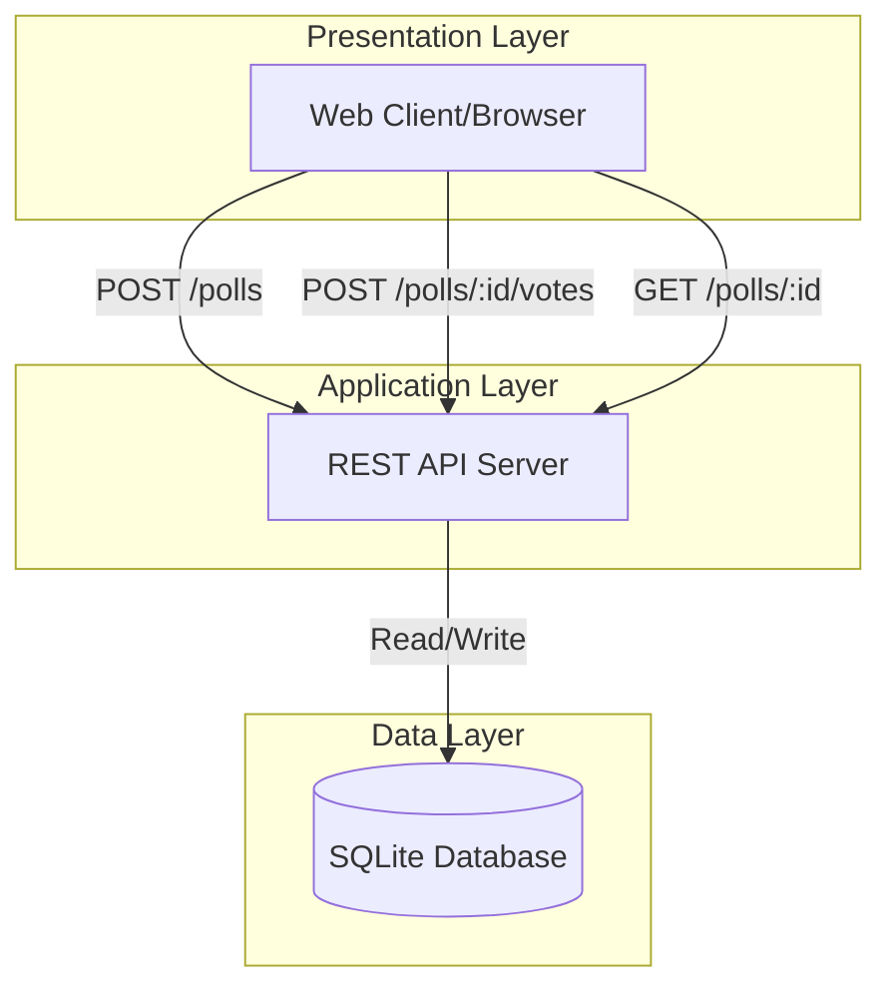

# System Architecture — Friday Snack Vote

## Architecture Overview

The Friday Snack Vote application is a lightweight polling system built with a simple REST API and SQLite database backend.

### Architecture Diagram

## Components

### 1. REST API Server
- Handles HTTP requests for poll operations
- Validates input data
- Manages database transactions
- Returns JSON responses

### 2. SQLite Database
- Lightweight, file-based database
- Stores polls and votes
- No separate database server required
- Suitable for small to medium traffic

### 3. Client Layer
- Web browser interface
- Consumes REST API endpoints
- Displays poll forms and results

## Data Flow

### Create Poll Flow
1. Client sends POST request to `/polls` with poll data
2. API validates poll structure
3. API creates poll record in SQLite
4. API returns poll ID and shareable link

### Vote Flow
1. Client sends POST request to `/polls/:id/votes` with vote choice
2. API validates poll exists
3. API records vote in database
4. API returns confirmation

### View Results Flow
1. Client sends GET request to `/polls/:id`
2. API retrieves poll and aggregated vote counts
3. API returns poll details with results

## Technology Stack
- **Database**: SQLite
- **API**: RESTful HTTP endpoints
- **Authentication**: None (anonymous voting)
- **Data Format**: JSON

## Design Decisions
- **No authentication**: Simplifies user experience; acceptable for low-stakes internal polls
- **SQLite**: Minimal setup, sufficient for expected load
- **REST API**: Standard, well-understood interface pattern
