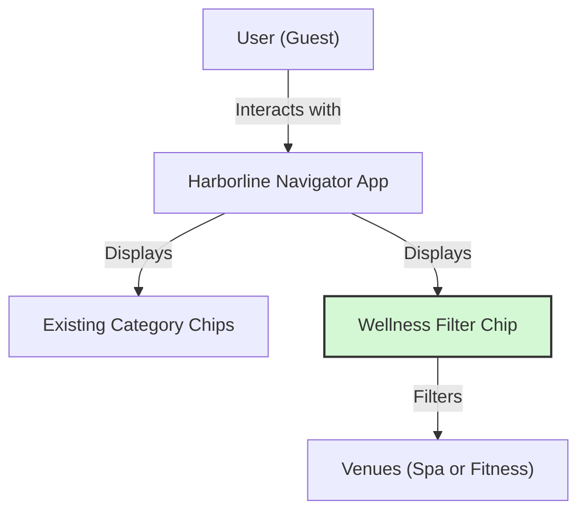

```mermaid
flowchart TD
    A["User (Guest)"] -->|"Interacts with"| B[Harborline Navigator App]
    B -->|"Displays"| C[Existing Category Chips]
    B -->|"Displays"| D[Wellness Filter Chip]
    D -->|"Filters"| E["Venues (Spa or Fitness)"]
    classDef added fill:#d4f8d4,stroke:#333,stroke-width:2px;
    class D added;
```
