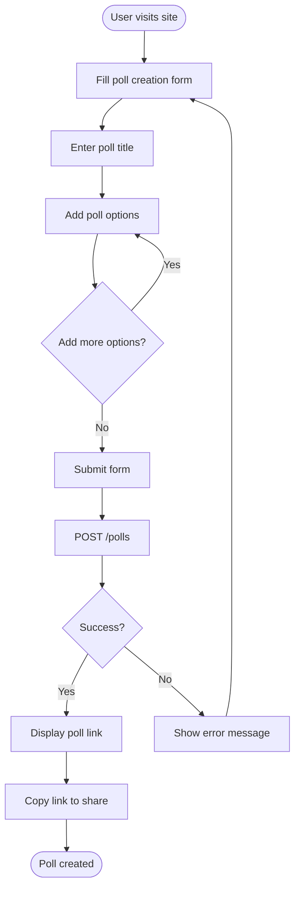
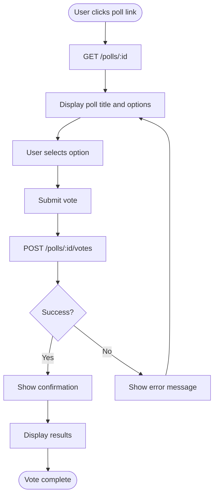
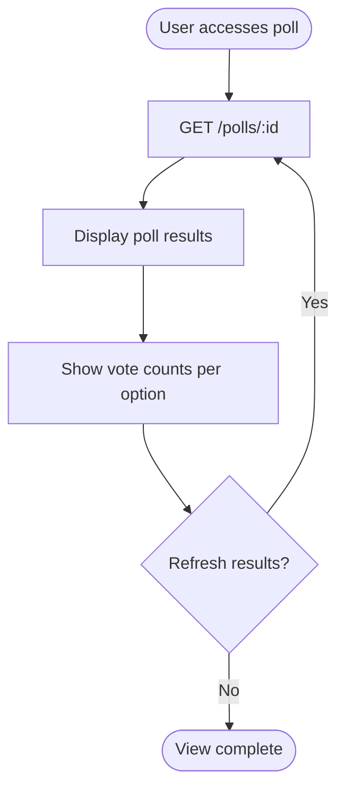
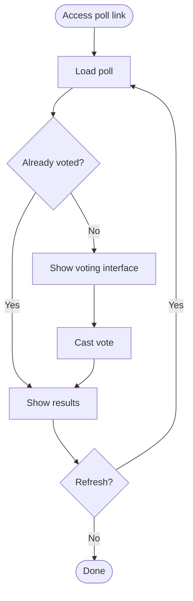

# User Flows — Friday Snack Vote

## Overview
This document describes the user interaction flows for the Friday Snack Vote application.

## Flow 1: Create Poll

### User Journey
1. User navigates to the poll creation page
2. User enters poll title (e.g., "Friday Snack Choice")
3. User adds multiple options (e.g., "Pizza", "Tacos", "Sushi")
4. User submits the form
5. System creates poll and displays shareable link
6. User copies link to share with voters

### Flow Diagram

### UI Elements
- Text input: Poll title
- Dynamic option inputs: Add/remove options
- Submit button: Create poll
- Result display: Shareable poll URL
- Copy button: Copy link to clipboard

---

## Flow 2: Vote on Poll

### User Journey
1. User receives poll link (via email, chat, etc.)
2. User clicks link and sees poll question with options
3. User selects their preferred option
4. User submits vote
5. System confirms vote submission
6. User sees current results (optional)

### Flow Diagram

### UI Elements
- Poll title display
- Radio buttons or clickable cards for options
- Submit button: Cast vote
- Confirmation message
- Results display with vote counts

---

## Flow 3: View Results

### User Journey
1. User accesses poll link (same as voting link)
2. System displays poll results with vote counts
3. User sees which option is winning
4. User can refresh to see updated results

### Flow Diagram

### UI Elements
- Poll title
- Options with vote counts
- Visual indicators (bars, percentages)
- Total vote count
- Refresh button (optional)

---

## Combined Flow: Vote and View

Many users will both vote and view results in a single session:

## Navigation Patterns

### Primary Navigation
- Home/Create Poll (landing page)
- Poll View (via shareable link)

### No Navigation Required For
- User accounts (no authentication)
- Poll history (no listing)
- Settings (no configuration)

## Error Handling

### Common Error Scenarios
1. **Poll not found**: Display friendly "Poll not found" message
2. **Invalid vote**: Show validation error, allow retry
3. **Network error**: Display error with retry button
4. **Invalid poll creation**: Highlight form errors inline

## Accessibility Considerations
- Keyboard navigation for all interactive elements
- Screen reader labels for form inputs
- Clear focus indicators
- Error messages announced to assistive technology
- Sufficient color contrast for results visualization

## Mobile Considerations
- Responsive layout for small screens
- Touch-friendly button sizes
- Simplified navigation
- Fast loading for mobile networks
