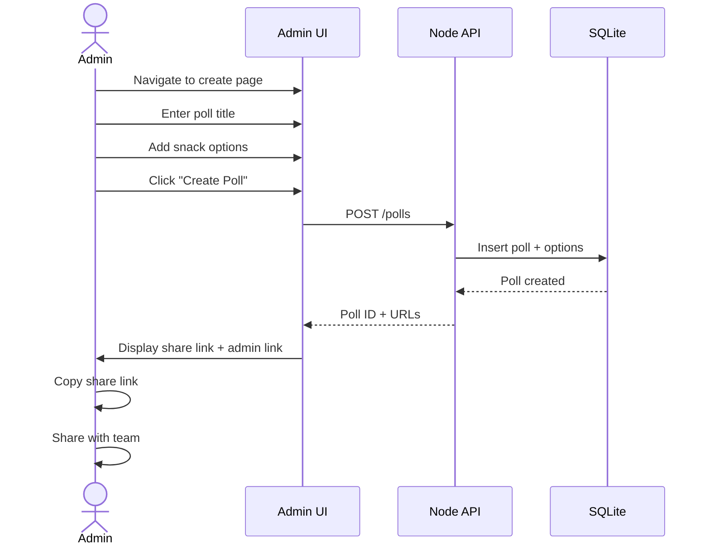
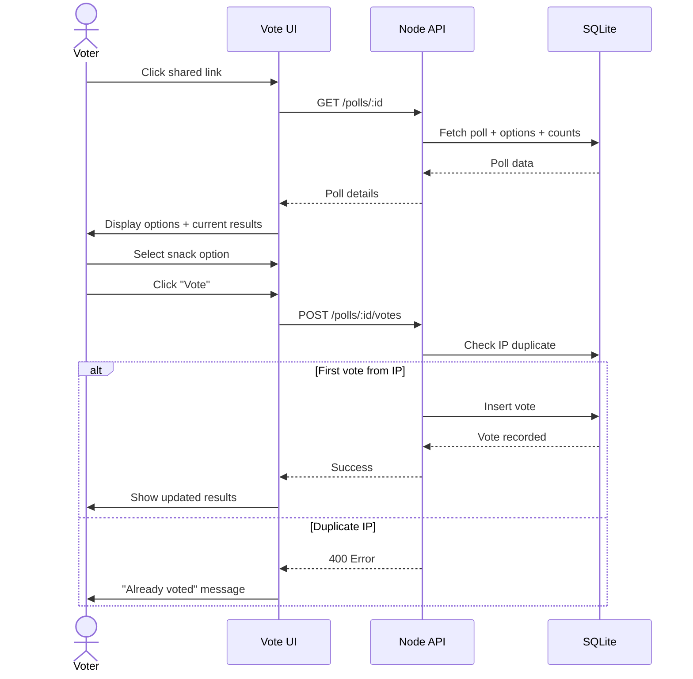
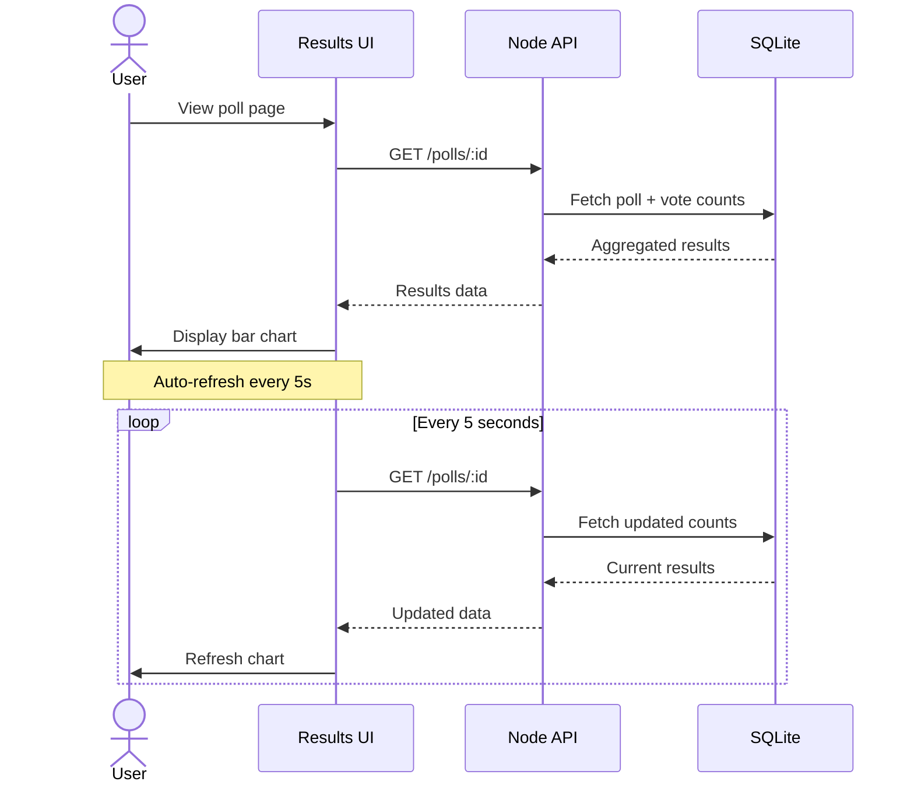

# User Flows — Friday Snack Vote

## Admin Flow: Create Poll

## Voter Flow: Cast Vote

## Results View Flow

## UI Screens

### 1. Poll Creation (Admin)
**URL:** `/admin?token=<magic_token>`

**Elements:**
- Poll title input field
- Dynamic option list (add/remove)
- "Create Poll" button
- Generated share link (after creation)
- Copy-to-clipboard button

### 2. Voting Interface (Public)
**URL:** `/polls/:id`

**Elements:**
- Poll title
- Radio button list of options
- Current vote count per option (bar chart)
- "Submit Vote" button
- Total votes counter

### 3. Results Display
**URL:** `/polls/:id` (after voting or direct access)

**Elements:**
- Poll title
- Horizontal bar chart showing:
  - Option name
  - Vote count
  - Percentage bar
- Winner highlight (most votes)
- Total votes
- Auto-refresh indicator

## Interaction Patterns

### Vote Submission
1. User selects option (radio button)
2. "Submit Vote" button enables
3. Click triggers API call
4. Loading spinner during submission
5. Success: Chart updates with animation
6. Error: Toast notification with message

### Real-time Updates
- Results refresh every 5 seconds via polling
- Smooth bar chart transitions
- New votes appear without page reload

### Mobile Considerations
- Touch-friendly radio buttons (min 44px)
- Responsive bar chart
- Single-column layout on mobile
- Large, tappable vote button
