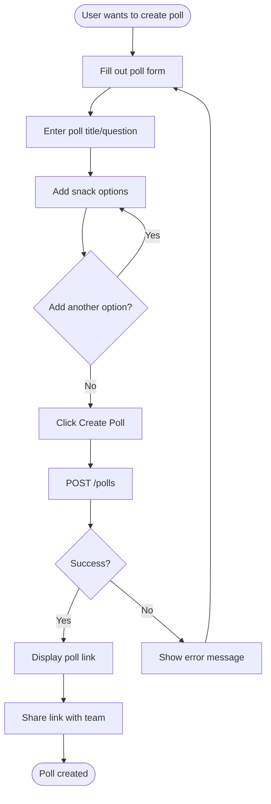
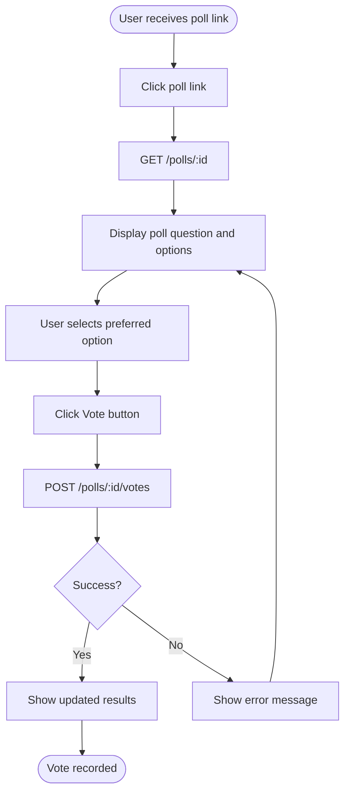
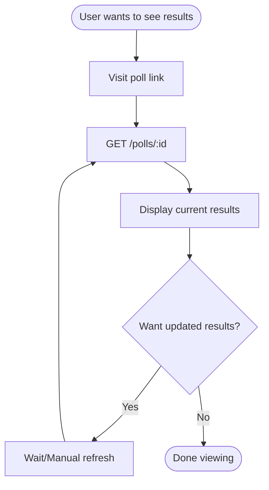

# User Flows: Friday Snack Vote

## Overview
This document describes the user interface flows for the Friday Snack Vote application.

## Flow 1: Create Poll

### Steps
1. User navigates to poll creation page
2. User enters poll title (e.g., "What snack should we get this Friday?")
3. User adds 2-10 snack options (e.g., "Pizza", "Tacos", "Sushi")
4. User clicks "Create Poll" button
5. System generates unique poll ID and shareable link
6. User copies link to share with team (via Slack, email, etc.)

### UI Elements
- **Poll Title Input**: Text field, max 200 characters
- **Option Inputs**: Multiple text fields, max 100 characters each
- **Add Option Button**: Adds new option field (max 10 options)
- **Remove Option Button**: Removes option field (min 2 options)
- **Create Poll Button**: Submits form
- **Shareable Link Display**: Read-only text field with copy button

## Flow 2: Vote on Poll

### Steps
1. User receives poll link from creator
2. User clicks link to open poll
3. System loads poll details and current results
4. User sees poll question and all snack options
5. User selects their preferred option (radio button)
6. User clicks "Vote" button
7. System records vote and updates display
8. User sees updated results with their vote counted

### UI Elements
- **Poll Title**: Heading displaying the question
- **Option List**: Radio buttons with option text and current vote counts
- **Vote Button**: Primary action button
- **Results Display**: Bar chart or list showing votes per option
- **Total Votes**: Counter showing total number of votes

## Flow 3: View Results

### Steps
1. User visits poll link (same link used for voting)
2. System loads poll with current vote counts
3. User sees results displayed as:
   - Each option with vote count
   - Visual representation (bars, percentages)
   - Total vote count
4. User can refresh page to see updated results

### UI Elements
- **Poll Title**: Heading displaying the question
- **Results List**: Each option showing:
  - Option text
  - Vote count
  - Percentage bar or visual indicator
- **Total Votes**: Summary count
- **Refresh Indicator**: Shows when results were last updated

## Responsive Design Considerations

### Mobile View
- Single column layout
- Large touch targets for radio buttons
- Full-width vote button
- Simplified results display

### Desktop View
- Wider layout with more whitespace
- Side-by-side option display (if space permits)
- Larger results visualization
- Copy link button with tooltip

## Accessibility

### Keyboard Navigation
- Tab through all interactive elements
- Enter/Space to select options
- Enter to submit vote

### Screen Readers
- Proper ARIA labels for all form elements
- Announce vote counts and percentages
- Announce when vote is successfully submitted

### Visual
- High contrast between text and background
- Clear focus indicators
- Minimum font size 14px
- Color not sole indicator of selection

## Error States

### Poll Not Found
- Display: "This poll doesn't exist or has been removed"
- Action: Provide link to create new poll

### Invalid Option
- Display: "Please select a valid option"
- Action: Highlight error, keep user on page

### Network Error
- Display: "Unable to submit vote. Please try again."
- Action: Retry button, preserve user's selection

### Rate Limited
- Display: "Too many requests. Please wait a moment."
- Action: Disable vote button temporarily

## Success States

### Poll Created
- Display: "Poll created successfully!"
- Show: Shareable link with copy button
- Action: Confirm link copied to clipboard

### Vote Submitted
- Display: "Your vote has been recorded!"
- Show: Updated results with animation
- Action: Highlight user's selected option

## Loading States

### Creating Poll
- Display: Loading spinner on Create button
- Text: "Creating poll..."

### Submitting Vote
- Display: Loading spinner on Vote button
- Text: "Submitting vote..."

### Loading Results
- Display: Skeleton screen or spinner
- Text: "Loading poll..."
