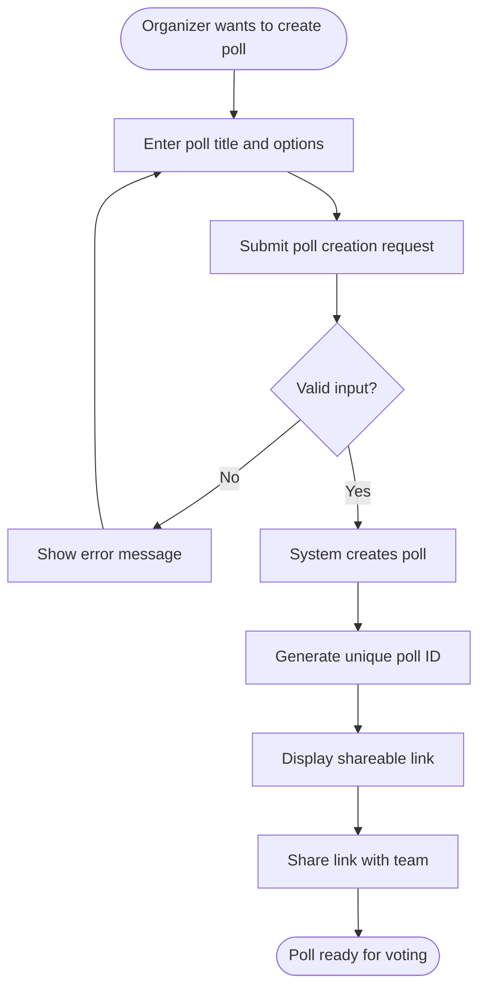
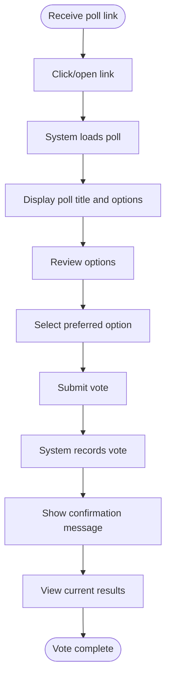
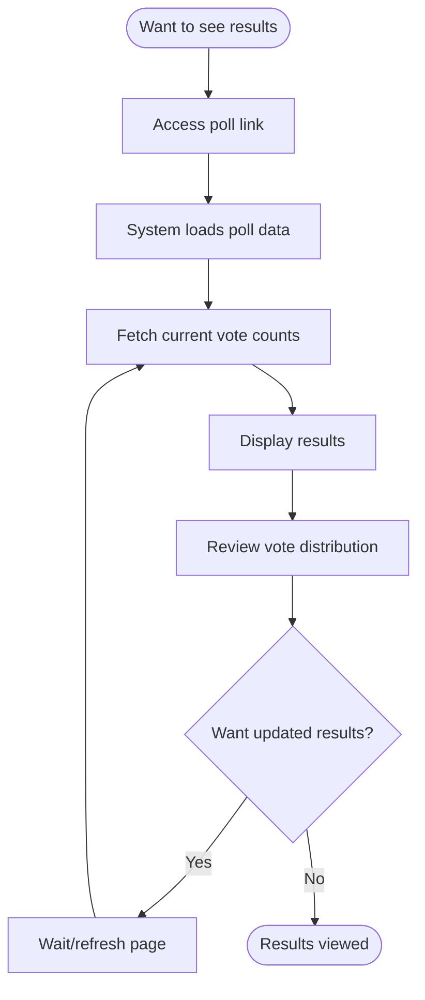
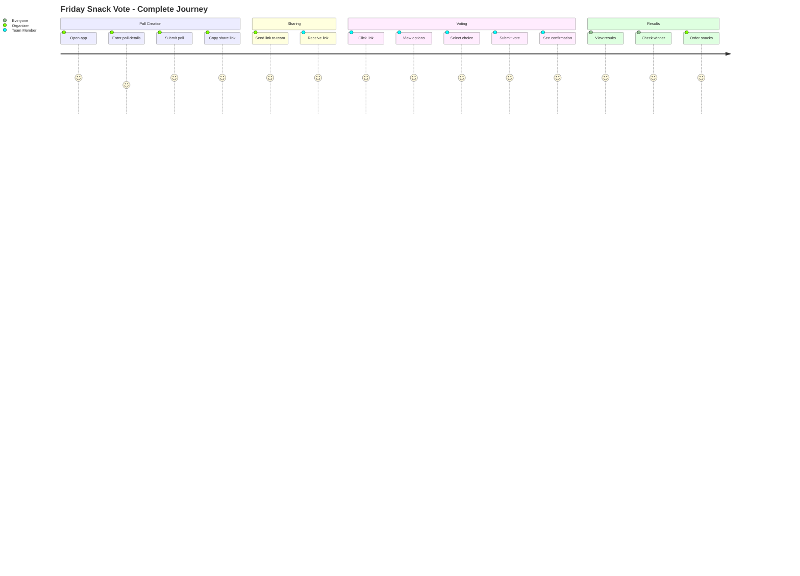
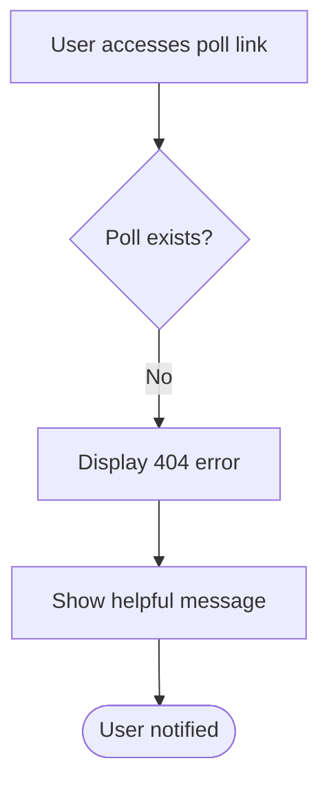
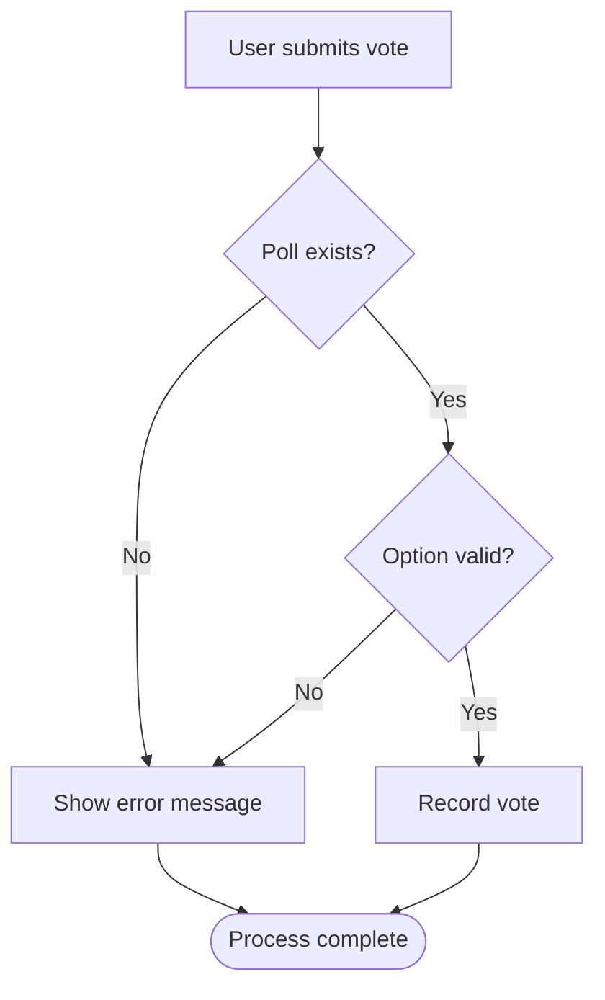

# User Flows - Friday Snack Vote

## Overview
This document describes the user interaction flows for the Friday Snack Vote application.

## Flow 1: Create a Poll



### Steps
1. **Organizer accesses poll creation interface**
   - Opens application or API client
   - Navigates to poll creation

2. **Enter poll details**
   - Input: Poll title (e.g., "Friday Snack Choice")
   - Input: Multiple options (e.g., "Pizza", "Tacos", "Sushi")
   - Minimum 2 options required

3. **Submit poll**
   - Click submit/send POST request
   - System validates input

4. **Receive poll link**
   - System returns unique poll ID
   - Shareable URL displayed (e.g., `/polls/abc123xyz`)
   - Copy link to clipboard

5. **Share with team**
   - Send link via Slack, email, or other channels
   - Team members can now vote

---

## Flow 2: Vote on a Poll



### Steps
1. **Receive poll link**
   - Team member receives link via communication channel
   - Example: `https://app.example.com/polls/abc123xyz`

2. **Access poll**
   - Click link or paste into browser
   - No login required

3. **View poll details**
   - Poll title displayed
   - All available options shown
   - Current vote counts visible (optional)

4. **Select option**
   - Choose one option from the list
   - Review choice before submitting

5. **Submit vote**
   - Click vote button or send POST request
   - System validates poll ID and option ID

6. **Receive confirmation**
   - Success message displayed
   - Vote count updates immediately

7. **View results** (optional)
   - See updated vote tallies
   - Compare option popularity

---

## Flow 3: View Poll Results



### Steps
1. **Access poll**
   - Open poll link (same link used for voting)
   - Can be accessed before or after voting

2. **View results**
   - Poll title displayed
   - Each option shows:
     - Option text
     - Current vote count
     - Percentage (if calculated by client)
   - Total vote count displayed

3. **Refresh for updates** (optional)
   - Reload page or re-fetch data
   - See latest vote counts
   - No automatic real-time updates

---

## User Journey Map



---

## Error Handling Flows

### Invalid Poll ID


**Error Message Example:**
```
Poll not found
The poll you're looking for doesn't exist or may have been deleted.
Please check the link and try again.
```

### Invalid Vote Submission


**Error Message Examples:**
```
Invalid option selected
Please select a valid option from the list.

Poll not found
The poll you're trying to vote on doesn't exist.
```

---

## Interaction Patterns

### No Authentication Flow
- **Benefit**: Immediate access, no friction
- **Pattern**: Link-based access control
- **Security**: Obscure poll IDs prevent guessing

### Stateless Voting
- **Pattern**: Each vote is independent
- **No session**: No cookies or login state
- **Simplicity**: Single API call per action

### Results Polling
- **Pattern**: Client-initiated refresh
- **No push**: Server doesn't push updates
- **Trade-off**: Not real-time, but simpler implementation

---

## Accessibility Considerations

### Keyboard Navigation
- All interactive elements should be keyboard accessible
- Tab order should be logical (title → options → submit)

### Screen Readers
- Poll title should be announced
- Options should be clearly labeled
- Vote confirmation should be announced

### Mobile Responsiveness
- Links should work on mobile devices
- Touch targets should be appropriately sized
- Layout should adapt to small screens

---

## Performance Expectations

### Page Load Times
- Poll creation: < 500ms
- Poll loading: < 300ms
- Vote submission: < 300ms
- Results refresh: < 200ms

### User Feedback
- Immediate visual feedback on interactions
- Loading indicators for async operations
- Clear success/error messages
